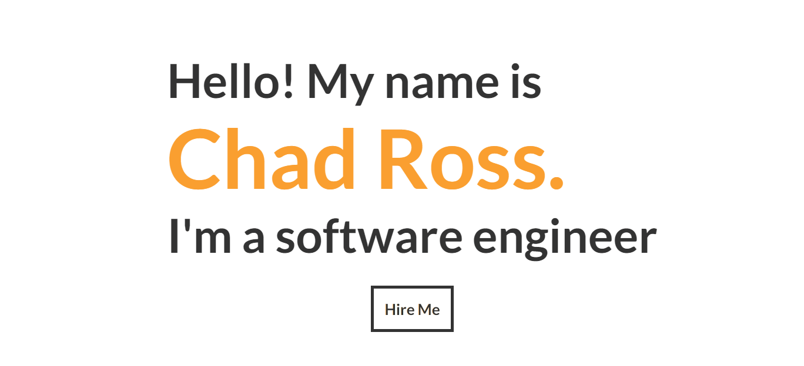

<!-- ### Hi there 👋, I'm Chad
I am a recent grad from Biola University and I am looking to apply my knowlege and experence in software engineering.
-->

&nbsp;&nbsp;&nbsp;&nbsp; &nbsp;&nbsp;&nbsp;&nbsp; &nbsp;&nbsp;&nbsp;&nbsp;

<!--
**chadrt21/chadrt21** is a ✨ _special_ ✨ repository because its `README.md` (this file) appears on your GitHub profile.

Here are some ideas to get you started:

- 🔨 I’m currently working on ...
- 🌱 I’m currently learning ...
- 👯 I’m looking to collaborate on ...
- 🤔 I’m looking for help with ...
- 💬 Ask me about ...
- 📫 How to reach me: ...
- ⚡ Fun fact: ...
-->

## 💻 I’m currently working on ...
### [MinMax DnD](https://minmaxdnd.com/) 
Min Max DnD is an Dugeons and Dragons toolboox to create, plan, and develop multiclass characters.

&nbsp;&nbsp;

&nbsp;&nbsp;

### [Github Game Off 2021: Bug Hunt](https://github.com/chadrt21/bug-hunt)
Github Game Off 2021 is an annual game jam, where participants spend the month of November creating games based on a secret theme. Participate individually, or as a team. Use whatever game engines, libraries, and languages you like.

The theme for this year's Game Off is **BUG**.

&nbsp;&nbsp;

&nbsp;&nbsp;
### [Campaign Buddy](https://github.com/chadrt21/dnd-webMaster)
Web application for Game Masters of TTRGB to orgainize, prep, and run their games from all one place. Includes quick reference notes, interactive maps, integrated music, customizeable dice role generator, and more. 

&nbsp;&nbsp;

&nbsp;&nbsp;&nbsp;&nbsp;

<!-- ### Stock Tracker Widget Android App
Fork of [Stocks Tracker Widget](https://github.com/premnirmal/StockTicker) but includes trends of 1 week, 1 month, and 1 year on the widget

 &nbsp;&nbsp;&nbsp;&nbsp;

-->
<!--
## 🌱 I'm currently learning...

  &nbsp;&nbsp;
  &nbsp;&nbsp;
  &nbsp;&nbsp;
  &nbsp;&nbsp;
  &nbsp;&nbsp;

-->

## :hammer: Tools I use...

  &nbsp;&nbsp;
  &nbsp;&nbsp;
  &nbsp;&nbsp;
  &nbsp;&nbsp;
  &nbsp;&nbsp;
  <!-- &nbsp;&nbsp; -->

  &nbsp;&nbsp;
  &nbsp;&nbsp;
  &nbsp;&nbsp;
  &nbsp;&nbsp;

 
  &nbsp;&nbsp;
  &nbsp;&nbsp;
  &nbsp;&nbsp;
  <!-- 
  &nbsp;&nbsp;
  &nbsp;&nbsp;
  -->

<!-- ###### README style inspired by [@StefanyVasc](https://github.com/StefanyVasc) -->

